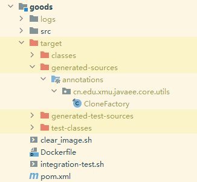

# CopyFrom指南

作者：厦门大学信息学院2020级陈一鸣 

旨在寻找一种高效便捷的方法作为cloneObj的替代品，实现vo、dto、bo和po之间的互相拷贝。

## cloneObj分析

cloneObj实际上只是完成po, bo, dto, vo之间的转换，每个类实际上需要执行的转换个数并不多。故考虑依靠JavaPoet在编译时直接生成这些拷贝方法，而不再使用运行时的反射机制。

## 基本原理

创建注解CopyFrom

```java
@Target({ ElementType.TYPE })
@Retention(RetentionPolicy.SOURCE)
public @interface CopyFrom {
    Class<?>[] value();
}
```

该注解只能应用于类，参数表示该类的对象可以从哪些类拷贝而来。

创建注解处理器，在编译时使用javapoet生成CloneFactory。所有添加了CopyFrom注解的类会自动生成copy方法，并保存在CloneFactory中。

cloneObj方法由于需要使用两次反射完成拷贝，造成大量的性能浪费。但本方法完全不需要用到反射，且所有操作都在编译期完成，理论上不会对性能有任何负面影响。

## 示例

```java
@AllArgsConstructor
@NoArgsConstructor
public class TestA {
    Integer x;
    Integer y;

    public Integer getY() {
        return y;
    }

    public Integer getX() {
        return x;
    }
}
```

```java
@AllArgsConstructor
@NoArgsConstructor
public class TestB {
    Integer x;
    Integer z;

    public Integer getX() {
        return x;
    }

    public Integer getZ() {
        return z;
    }
}
```

```java
@AllArgsConstructor
@NoArgsConstructor
@CopyFrom({ TestA.class, TestB.class })
public class TestC {
    Integer y;
    Integer z;

    public void setY(Integer y) {
        this.y = y;
    }

    public void setZ(Integer z) {
        this.z = z;
    }
}
```

生成的CloneFactory:

```java
public final class CloneFactory {
  /**
   * Copy all fields from source to target
   * @param target the target object
   * @param source the source object
   * @return the copied target object
   */
  public static TestC copy(TestC target, TestA source) {
    target.setY(source.getY());
    return target;
  }

  /**
   * Copy all fields from source to target
   * @param target the target object
   * @param source the source object
   * @return the copied target object
   */
  public static TestC copy(TestC target, TestB source) {
    target.setZ(source.getZ());
    return target;
  }
}
```

拷贝对象：

```java
TestA a = new TestA(1, 2);
TestC c = new TestC(3, 4);
CloneFactory.copy(c, a);  // 将a的内容拷贝到c
assert c.getY() == 2;
assert c.getZ() == 4;
```

克隆对象：
```java
TestB b = new TestB(1, 2);
TestC c = CloneFactory.copy(new TestC(), b);  // copy方法会将拷贝后的结果返回
assert c.getY() == null;
assert c.getZ() == 2;
```

## 目前的问题

1. 与lombok的@Getter与@Setter冲突。Java要求注解processor之间不得相互依赖，不得因为处理顺序不同而得到不同结果。因此在原理上，本注解无法与@Getter, @Setter同时使用。也就是说，所有的getter和setter都需要手动或使用IDEA自动生成。
2. 操作繁琐。每次添加或修改CopyFrom注解，都需要rebuild一次当前模块。此处需要帮助，能否实现自动rebuild？

## 其他需要注意的地方

1. 需要将使用CopyFrom的模块编译生成的target目录下的generated-sources/annotations文件夹标记为`Generated source root`，以让IDEA识别到自动生成的代码。

   

   如在goods模块中使用该注解，正确的结果应当为

   